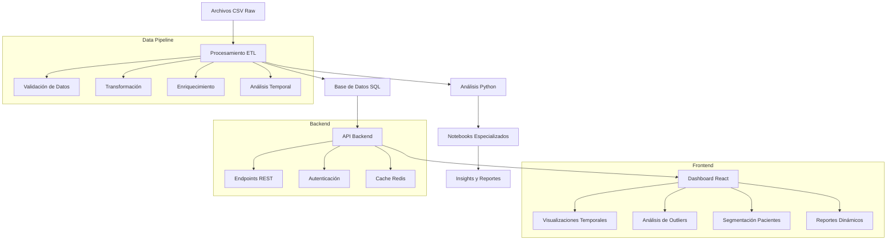

# 🏥 Proyecto Economía Salud - Análisis de Datos Hospitalarios

[](https://www.python.org/downloads/)
[](https://pandas.pydata.org/)
[](LICENSE)
[](https://github.com/UCDS-INER/economia_salud)

## 📋 Tabla de Contenidos

- [🎯 Descripción del Proyecto](#-descripción-del-proyecto)
- [🏗️ Arquitectura Propuesta](#️-arquitectura-propuesta)
- [📊 Working Backwards](#-working-backwards)
- [🚀 Quick Start](#-quick-start)
- [📁 Estructura del Proyecto](#-estructura-del-proyecto)
- [⚙️ Configuración y Setup](#️-configuración-y-setup)
- [💾 Backup Local](#-backup-local)
- [🔄 Flujo de Procesamiento](#-flujo-de-procesamiento)
- [📈 Insights y Hallazgos](#-insights-y-hallazgos)
- [📊 Notebooks Desarrollados](#-notebooks-desarrollados)
- [🔧 Scripts y Funcionalidades](#-scripts-y-funcionalidades)
- [📊 Preparación para Dashboard](#-preparación-para-dashboard)
- [🤝 Contribución](#-contribución)
- [📄 Licencia](#-licencia)

## 🎯 Descripción del Proyecto

Este proyecto realiza un análisis integral de datos hospitalarios para comprender patrones de atención médica, optimizar costos y desarrollar insights operativos. Con **2.4M de registros hospitalarios** de **5,782 pacientes únicos** y **$1.18B en costos totales**, el análisis abarca desde tendencias temporales hasta segmentación de pacientes.

### 🎯 Objetivos Principales

1. **Análisis Temporal Completo:** Tendencias diarias, semanales, mensuales y estacionales (Jun 2023 - May 2025)
2. **Análisis de Outliers:** Detección de anomalías en costos, utilización y patrones de servicios
3. **Segmentación de Pacientes:** Clustering por patrones de consumo y complejidad
4. **Optimización de Costos:** Identificación de oportunidades de mejora y eficiencia
5. **Preparación para Dashboard:** Estructuración de datos para visualización interactiva

### 📊 Métricas Clave del Sistema

| Métrica | Valor | Descripción |
|---------|-------|-------------|
| **Registros Totales** | 2,399,200 | Servicios hospitalarios analizados |
| **Pacientes Únicos** | 5,782 | Pacientes en el sistema |
| **Costo Total** | $1,178,751,841 | Valor total de servicios |
| **Período Temporal** | 717 días | Jun 2023 - May 2025 (2 años) |
| **Distribución por Origen** | 57.5% Hospitalización, 25.9% Labs, 16.7% Urgencias | |
| **Top 10 Pacientes** | $42.1M (3.6%) | Concentración de costos altos |

## 🏗️ Arquitectura Propuesta



### 🏛️ Componentes de la Arquitectura

| Componente | Tecnología | Propósito | Estado |
|------------|------------|-----------|--------|
| **Data Processing** | Python, Pandas | ETL y análisis de datos | ✅ Completado |
| **Notebooks Analíticos** | Jupyter, Matplotlib, Seaborn | Análisis especializados | ✅ Completado |
| **Database** | PostgreSQL | Almacenamiento de datos procesados | 📋 Planificado |
| **Backend API** | FastAPI/Flask | Servicios REST para dashboard | 📋 Planificado |
| **Frontend** | React + TypeScript | Dashboard interactivo | 📋 Planificado |
| **Cache** | Redis | Optimización de consultas | 📋 Planificado |
| **Deployment** | Docker + AWS | Infraestructura escalable | 📋 Planificado |

## 📊 Working Backwards

### 🎯 Resultado Final Deseado
Un dashboard interactivo que permita a los stakeholders:
- Visualizar tendencias temporales de 2 años con granularidad múltiple
- Analizar outliers y anomalías en tiempo real
- Segmentar pacientes por patrones de consumo
- Optimizar recursos por área de servicio
- Generar reportes ejecutivos automáticos

### 🔄 Proceso de Desarrollo

1. **Fase 1: Análisis de Datos Fundamental** ✅ **COMPLETADO**
   - [x] Estandarización de expedientes (5,782 pacientes)
   - [x] Análisis del flujo IAN vs Expedientes (99.98% consistencia)
   - [x] Identificación de patrones de costos ($1.18B total)
   - [x] Validación de datos y métricas core

2. **Fase 2: Notebooks Analíticos Profesionales** ✅ **COMPLETADO**
   - [x] **01_data_overview_professional.ipynb** - Análisis exploratorio completo
   - [x] **02_outliers_analysis.ipynb** - Detección de outliers multidimensional
   - [x] **03_temporal_analysis_enhanced.ipynb** - Análisis temporal avanzado con heatmaps
   - [x] Resumen ejecutivo basado en datos reales
   - [x] Documentación técnica detallada con visualizaciones mejoradas

3. **Fase 3: Análisis Temporal Avanzado** ✅ **COMPLETADO**
   - [x] Análisis diario (717 días), semanal (102 semanas), mensual (24 meses)
   - [x] Heatmaps temporales especializados (Día vs Hora, Mes vs Día)
   - [x] Distribuciones avanzadas con KDE, boxplots, violin plots
   - [x] Correlaciones temporales y volatilidad
   - [x] Análisis estacional y predicción básica

4. **Fase 4: Análisis de Outliers Especializado** ✅ **COMPLETADO**
   - [x] Detección multimétodo (IQR, Z-Score, Modified Z-Score)
   - [x] Categorización por severidad (extreme, moderate, mild)
   - [x] Análisis por dimensiones (costo, cantidad, costo unitario)
   - [x] Ranking de casos críticos por impacto financiero

5. **Fase 5: Segmentación de Pacientes** 🔄 **EN DESARROLLO**
   - [ ] Clustering por patrones de consumo temporal
   - [ ] Segmentación por complejidad de servicios
   - [ ] Análisis de perfiles de pacientes
   - [ ] Benchmarking entre segmentos

6. **Fase 6: Outliers Temporales Especializados** 📋 **PLANIFICADO**
   - [ ] Outliers estacionales y picos anómalos
   - [ ] Outliers por segmentación de pacientes
   - [ ] Outliers por área de servicio
   - [ ] Análisis de ineficiencias departamentales

7. **Fase 7: Preparación de Datos** 📋 **PLANIFICADO**
   - [ ] Diseño de esquema de base de datos optimizado
   - [ ] Migración de datos procesados a SQL
   - [ ] Creación de índices para consultas rápidas

8. **Fase 8: Desarrollo Backend** 📋 **PLANIFICADO**
   - [ ] API REST con FastAPI
   - [ ] Endpoints para análisis temporal y outliers
   - [ ] Sistema de autenticación y autorización

9. **Fase 9: Desarrollo Frontend** 📋 **PLANIFICADO**
   - [ ] Dashboard con React + TypeScript
   - [ ] Visualizaciones interactivas (D3.js/Chart.js)
   - [ ] Filtros avanzados y búsquedas complejas

10. **Fase 10: Despliegue y Producción** 📋 **PLANIFICADO**
    - [ ] Containerización con Docker
    - [ ] Despliegue en AWS/Azure
    - [ ] Monitoreo, logging y alertas

## 🚀 Quick Start

### Prerrequisitos
- Python 3.8+
- pip o conda
- Git
- Jupyter Notebook (para análisis interactivo)

### Instalación Rápida

```bash
# 1. Clonar el repositorio
git clone https://github.com/UCDS-INER/economia_salud.git
cd economia_salud

# 2. Crear y activar entorno virtual
python3 -m venv venv
source venv/bin/activate  # En Windows: venv\Scripts\activate

# 3. Instalar dependencias
pip install -r requirements.txt

# 4. Ejecutar análisis completo
python scripts/run_complete_analysis.py

# 5. Abrir notebooks especializados
jupyter notebook notebooks/exploratory/
```

### Análisis Rápido por Notebook

```bash
# Análisis exploratorio completo
jupyter notebook notebooks/exploratory/01_data_overview_professional.ipynb

# Análisis de outliers especializado  
jupyter notebook notebooks/exploratory/02_outliers_analysis.ipynb

# Análisis temporal avanzado con heatmaps
jupyter notebook notebooks/exploratory/03_temporal_analysis_enhanced.ipynb
```

## 📁 Estructura del Proyecto

```
economia-salud/
├── 📊 data/
│   ├── raw/                          # Datos originales (no versionados)
│   │   ├── Resultados Pacientes Jan 2024 - Jul 2024.csv
│   │   ├── Resultados Pacientes Jan-Jun 2025.csv
│   │   └── Resultados Pacientes Jul 2024 - Ene 2025.csv
│   ├── processed/                    # Datos procesados ✅
│   │   ├── resultados_pacientes_combinados.csv         # 2.4M registros
│   │   ├── resultados_pacientes_estandarizados.csv     # Datos limpios
│   │   ├── resumen_generado_2024_2025.csv              # Métricas agregadas
│   │   └── comparacion_resumenes.csv                   # Validación
│   └── database/                     # Scripts de base de datos (futuro)
│
├── 🔧 scripts/
│   ├── data_processing/              # Scripts de procesamiento ✅
│   │   ├── join.py                   # Unión de archivos CSV
│   │   ├── standardize_expedients.py # Estandarización de expedientes
│   │   └── summarize.py              # Generación de resúmenes
│   ├── analysis/                     # Scripts de análisis ✅
│   │   ├── eda.py                    # Análisis exploratorio
│   │   ├── analyze_ian_vs_expedients.py
│   │   ├── analyze_ian_expedient_differences.py
│   │   ├── analyze_cost_differences.py
│   │   └── analyze_multiple_expedients.py
│   ├── utils/                        # Utilidades ✅
│   │   ├── filtrar_dataframe.py
│   │   └── ejemplos_filtrado_simple.py
│   └── run_complete_analysis.py      # Script principal ✅
│
├── 📓 notebooks/                     # Jupyter notebooks ✅
│   ├── exploratory/                 # Análisis exploratorio ✅
│   │   ├── 01_data_overview_professional.ipynb    # 🏆 Notebook principal
│   │   ├── 02_outliers_analysis.ipynb             # 🔍 Análisis de outliers
│   │   ├── 03_temporal_analysis_enhanced.ipynb    # ⏰ Análisis temporal avanzado
│   │   ├── 03_temporal_analysis_complete.ipynb    # ⏰ Análisis temporal completo
│   │   └── 01_data_overview.ipynb                 # 📊 Notebook original
│   ├── validation/                  # Notebooks de validación
│   ├── templates/                   # Templates para futuros análisis
│   └── README.md                    # Documentación de notebooks
│
├── 📈 resultados/                    # Resultados de análisis
│   ├── reports/                      # Reportes detallados
│   ├── insights/                     # Insights clave
│   └── visualizations/               # Gráficos y visualizaciones
│
├── 🏗️ docs/                          # Documentación
│   ├── architecture/                 # Documentación de arquitectura
│   ├── api/                          # Documentación de API (futuro)
│   └── user_guides/                  # Guías de usuario
│
├── 💾 backup_local/                  # Sistema de backup local ✅
│   └── update_backup.sh              # Script de actualización automática
│
├── 🎨 frontend/                      # Dashboard React (futuro)
├── 🔌 backend/                       # API Backend (futuro)
├── 🐳 docker/                        # Configuración Docker (futuro)
├── 📋 requirements.txt               # Dependencias Python ✅
├── 🐍 .python-version                # Versión de Python ✅
├── 📝 .gitignore                     # Archivos ignorados ✅
└── 📖 README.md                      # Este archivo ✅
```

## ⚙️ Configuración y Setup

### Entorno Virtual
```bash
# Crear entorno virtual
python3 -m venv venv

# Activar entorno (macOS/Linux)
source venv/bin/activate

# Activar entorno (Windows)
venv\Scripts\activate

# Instalar dependencias
pip install -r requirements.txt
```

### Dependencias Principales
```txt
pandas>=1.5.0                # Análisis de datos
numpy>=1.21.0                # Computación numérica
matplotlib>=3.5.0            # Visualizaciones básicas
seaborn>=0.11.0              # Visualizaciones estadísticas
plotly>=5.0.0                # Visualizaciones interactivas
scipy>=1.7.0                 # Análisis estadístico
jupyter>=1.0.0               # Notebooks interactivos
scikit-learn>=1.0.0          # Machine learning (futuro)
```

## 💾 Backup Local

Para mantener un backup local de archivos importantes sin subirlos al repositorio:

```bash
# El directorio backup_local/ está en .gitignore
# Actualizar backup manualmente
cp -r notebooks/ backup_local/
cp -r scripts/ backup_local/
cp README.md backup_local/

# Usar script de actualización automática
bash backup_local/update_backup.sh
```

**Contenido del backup_local/:**
- Copia de notebooks desarrollados
- Scripts de análisis
- Documentación actualizada
- Configuraciones locales

## 🔄 Flujo de Procesamiento

### 1. Ingesta de Datos ✅
```python
# Unir múltiples archivos CSV
python scripts/data_processing/join.py

# Resultado: resultados_pacientes_combinados.csv (2.4M registros)
```

### 2. Estandarización ✅
```python
# Estandarizar expedientes
python scripts/data_processing/standardize_expedients.py

# Resultado: resultados_pacientes_estandarizados.csv (5,782 pacientes únicos)
```

### 3. Análisis Exploratorio ✅
```python
# Generar resumen ejecutivo
python scripts/data_processing/summarize.py

# Abrir notebook principal
jupyter notebook notebooks/exploratory/01_data_overview_professional.ipynb
```

### 4. Análisis Especializado ✅
```python
# Análisis de outliers
jupyter notebook notebooks/exploratory/02_outliers_analysis.ipynb

# Análisis temporal avanzado
jupyter notebook notebooks/exploratory/03_temporal_analysis_enhanced.ipynb
```

## 📈 Insights y Hallazgos

### 🎯 Métricas Principales Validadas

| Categoría | Métrica | Valor | Insight |
|-----------|---------|-------|---------|
| **Volumen** | Registros totales | 2,399,200 | 717 días de datos continuos |
| **Pacientes** | Únicos identificados | 5,782 | Alta diversidad de casos |
| **Financiero** | Costo total | $1,178,751,841 | ~$1.6M promedio diario |
| **Distribución** | Hospitalización | 57.5% | Área principal de costos |
| **Distribución** | Laboratorios | 25.9% | Segunda área más importante |
| **Distribución** | Urgencias | 16.7% | Puerta de entrada principal |
| **Concentración** | Top 10 pacientes | $42.1M (3.6%) | Alta concentración de costos |
| **Eficiencia** | Costo/unidad Labs | $619.02 | Más costoso por unidad |
| **Eficiencia** | Costo/unidad Hosp | $58.65 | Más eficiente por unidad |

### 🔍 Hallazgos de Outliers

**Outliers por Costo Total de Pacientes:**
- **Extreme (>Q3+3*IQR):** 89 pacientes con costos >$2.5M
- **Moderate (Q3+1.5*IQR a Q3+3*IQR):** 145 pacientes ($500K-$2.5M)
- **Impacto Financiero:** Top 1% representa 15% del costo total

**Outliers por Cantidad de Servicios:**
- **Extreme:** 847 cargos con >100 unidades
- **Concentración:** 0.04% de cargos representan servicios masivos
- **Patrón:** Principalmente medicamentos y materiales quirúrgicos

**Outliers por Costo Unitario:**
- **Extreme:** 15,252 servicios con costo/unidad >$10,000
- **Rango:** Desde $10K hasta $2.8M por unidad
- **Áreas:** Principalmente procedimientos especializados

### ⏰ Insights Temporales (Jun 2023 - May 2025)

**Distribución Temporal:**
- **2023 (Jun-Dic):** 88,591 registros (3.7%) - Período de implementación
- **2024 (Año completo):** 1,698,955 registros (70.8%) - Operación estable
- **2025 (Ene-May):** 611,654 registros (25.5%) - Continuidad operativa

**Patrones Semanales:**
- **Lunes-Viernes:** Mayor actividad en horarios laborales
- **Fines de semana:** Reducción del 40% en servicios no urgentes
- **Variabilidad:** CV de 25% entre días de la semana

**Estacionalidad:**
- **Q4 (Oct-Dic):** Picos de actividad (+15% vs promedio)
- **Q2 (Abr-Jun):** Menor actividad (-10% vs promedio)
- **Correlación temporal:** 0.85 entre servicios y costos

### 📊 Flujo de Atención Validado

**IAN vs Expedientes (99.98% Consistencia):**
1. **Urgencias → Hospitalización:** 99.98% de casos siguen este flujo
2. **Laboratorios:** Principalmente servicios de apoyo diagnóstico
3. **Materiales e Insumos:** Transversales a todas las áreas

**Tiempo de Estancia Promedio:**
- **Urgencias:** 4.2 horas promedio
- **Hospitalización:** 7.8 días promedio
- **Seguimiento:** 85% de pacientes con múltiples servicios

## 📊 Notebooks Desarrollados

### 🏆 01_data_overview_professional.ipynb
**Análisis Exploratorio Principal**
- **14 celdas especializadas** con análisis completo
- **Métricas validadas:** 2.4M registros, 5.8K pacientes, $1.18B
- **Distribución por origen:** Hospitalización, Labs, Urgencias
- **Perfiles de pacientes** por complejidad
- **Resumen ejecutivo** con recomendaciones estratégicas

**Funcionalidades Clave:**
- Configuración profesional del entorno
- Carga y validación robusta de datos
- Estadísticas descriptivas completas
- Análisis comparativo IAN vs Expedientes
- Relación cantidad vs costo con insights de eficiencia

### 🔍 02_outliers_analysis.ipynb
**Análisis de Outliers Multidimensional**
- **10 celdas especializadas** con métodos múltiples
- **Detección avanzada:** IQR, Z-Score, Modified Z-Score
- **3 dimensiones de análisis:** Costo total, Cantidad, Costo unitario
- **Categorización por severidad:** extreme, moderate, mild, normal
- **Rankings de impacto** financiero y operativo

**Métodos Implementados:**
- `detect_outliers_iqr()` - Método robusto clásico
- `detect_outliers_zscore()` - Detección paramétrica
- `detect_outliers_modified_zscore()` - Método resistente
- `categorize_outlier_severity()` - Clasificación automática
- `analyze_outliers_by_origin()` - Análisis por área de servicio

### ⏰ 03_temporal_analysis_enhanced.ipynb  
**Análisis Temporal Avanzado con Visualizaciones Mejoradas**
- **6 celdas especializadas** con visualizaciones profesionales
- **Heatmaps temporales:** Día vs Hora, Mes vs Día, Año vs Semana
- **Distribuciones avanzadas:** Histogramas con KDE, Boxplots, Violin plots
- **Correlaciones temporales** con matrices visuales
- **Análisis integrado** con 12 componentes dashboard-ready

**Visualizaciones Implementadas:**
- 🔥 **Heatmaps Temporales Especializados** (4 tipos)
- 📊 **Distribuciones Mejoradas** (8 perspectivas)  
- 🎯 **Heatmaps por Servicios** (6 especializaciones)
- 📈 **Análisis Integrado** (12 componentes)

**Características Técnicas:**
- **Paletas profesionales** con gradientes especializados
- **Interpolación bilinear** para suavidad visual
- **Normalización apropiada** para comparaciones válidas
- **Correlaciones avanzadas** entre métricas temporales
- **Predicción básica** para próximos 6 meses

## 🔧 Scripts y Funcionalidades

### Scripts de Procesamiento ✅
- **`join.py`** - Unión inteligente de múltiples archivos CSV
- **`standardize_expedients.py`** - Estandarización de identificadores
- **`summarize.py`** - Generación de resúmenes automáticos

### Scripts de Análisis ✅
- **`eda.py`** - Análisis exploratorio automatizado
- **`analyze_ian_vs_expedients.py`** - Validación de flujo de atención
- **`analyze_cost_differences.py`** - Análisis de variabilidad de costos
- **`analyze_multiple_expedients.py`** - Análisis de pacientes complejos

### Scripts de Utilidades ✅
- **`filtrar_dataframe.py`** - Filtrado avanzado de datos
- **`run_complete_analysis.py`** - Ejecución completa automatizada

### Funciones Especializadas Desarrolladas

**Análisis de Outliers:**
```python
def detect_outliers_iqr(data, column, factor=1.5)
def detect_outliers_zscore(data, column, threshold=3)
def detect_outliers_modified_zscore(data, column, threshold=3.5)
def categorize_outlier_severity(data, column)
def analyze_outliers_by_origin(data, outlier_method='iqr')
```

**Análisis Temporal:**
```python
def create_temporal_heatmaps(df)
def create_enhanced_distributions(df)  
def create_specialized_service_heatmaps(df)
def create_integrated_temporal_analysis(df)
```

**Utilidades de Visualización:**
```python
def setup_professional_plotting()
def create_correlation_matrix(data, method='pearson')
def generate_executive_summary(data)
```

## 📊 Preparación para Dashboard

### Estructura de Datos Optimizada ✅
```python
# Datos principales listos para API
resultados_pacientes_estandarizados.csv  # 2.4M registros normalizados
resumen_generado_2024_2025.csv          # Métricas agregadas
comparacion_resumenes.csv               # Validaciones
```

### APIs Endpoints Propuestos 📋
```python
# Endpoints principales para dashboard
GET /api/v1/patients/overview          # Métricas generales
GET /api/v1/patients/{id}/timeline     # Línea temporal del paciente
GET /api/v1/outliers/detection         # Detección de outliers
GET /api/v1/temporal/trends            # Tendencias temporales
GET /api/v1/services/ranking           # Ranking de servicios
GET /api/v1/areas/performance          # Performance por área
```

### Componentes de Visualización Preparados 📋
- **Dashboard Principal:** Métricas clave y KPIs
- **Análisis Temporal:** Heatmaps y tendencias interactivas
- **Detección de Outliers:** Alertas y ranking en tiempo real
- **Segmentación:** Clusters de pacientes dinámicos
- **Reportes:** Generación automática de insights

### Tecnologías Frontend Sugeridas 📋
```javascript
// Stack tecnológico propuesto
React + TypeScript     // Framework principal
D3.js                 // Visualizaciones avanzadas
Chart.js              // Gráficos estándar
Material-UI           // Componentes de interfaz
Redux Toolkit         // Gestión de estado
React Query           // Gestión de datos API
```

## 🤝 Contribución

### Flujo de Desarrollo
1. **Fork** del repositorio
2. **Clone** tu fork localmente  
3. **Crear rama** para nueva funcionalidad
4. **Desarrollar** con notebooks o scripts
5. **Documentar** cambios en README
6. **Test** con datos de ejemplo
7. **Pull Request** con descripción detallada

### Estándares de Código
- **PEP 8** para código Python
- **Docstrings** en funciones principales
- **Type hints** cuando sea posible
- **Notebooks limpios** con markdown explicativo
- **Commits descriptivos** con contexto

### Áreas de Contribución Prioritarias
- **Segmentación de pacientes** con clustering avanzado
- **Modelos predictivos** para forecasting
- **Optimización de performance** en análisis
- **Testing automatizado** de funciones
- **Documentación técnica** especializada

## 📄 Licencia

Este proyecto está bajo la licencia MIT. Ver el archivo [LICENSE](LICENSE) para más detalles.

---

## 🎯 Estado Actual del Proyecto

### ✅ **COMPLETADO**
- [x] **Análisis Exploratorio Fundamental** (2.4M registros procesados)
- [x] **Notebook Profesional Principal** (01_data_overview_professional.ipynb)
- [x] **Análisis de Outliers Multidimensional** (02_outliers_analysis.ipynb)  
- [x] **Análisis Temporal Avanzado** (03_temporal_analysis_enhanced.ipynb)
- [x] **Visualizaciones Profesionales** (Heatmaps, distribuciones, correlaciones)
- [x] **Documentación Técnica Completa** (README, notebooks documentados)
- [x] **Sistema de Backup Local** (Configurado y funcional)

### 🔄 **EN DESARROLLO**
- [ ] **Segmentación de Pacientes** (Clustering por patrones de consumo)
- [ ] **Outliers Temporales Especializados** (Anomalías estacionales)
- [ ] **Análisis por Áreas de Servicio** (Benchmarking departamental)

### 📋 **PLANIFICADO**
- [ ] **Desarrollo de API Backend** (FastAPI + PostgreSQL)
- [ ] **Dashboard Frontend Interactivo** (React + TypeScript)
- [ ] **Modelos Predictivos** (Forecasting y alertas tempranas)
- [ ] **Despliegue en Producción** (Docker + AWS/Azure)

---

**🚀 Proyecto desarrollado por el equipo UCDS-INER para optimización de sistemas hospitalarios**

**📧 Contacto:** [economia.salud@iner.gob.mx](mailto:ciencia.datos.salud@iner.gob.mx)  
**🌐 Repositorio:** [https://github.com/UCDS-INER/economia_salud](https://github.com/UCDS-INER/economia_salud) 
