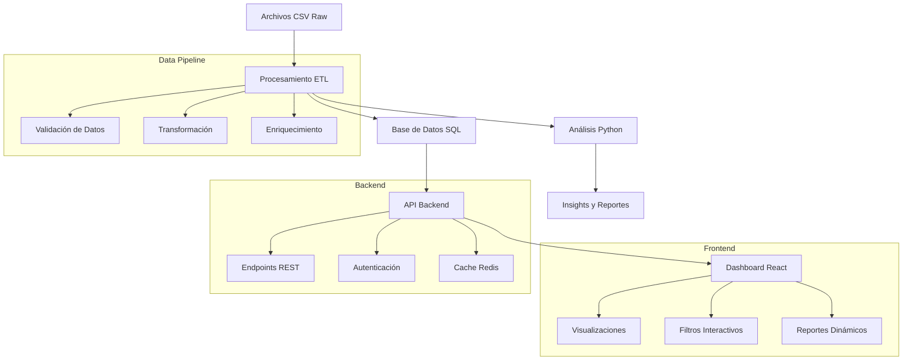
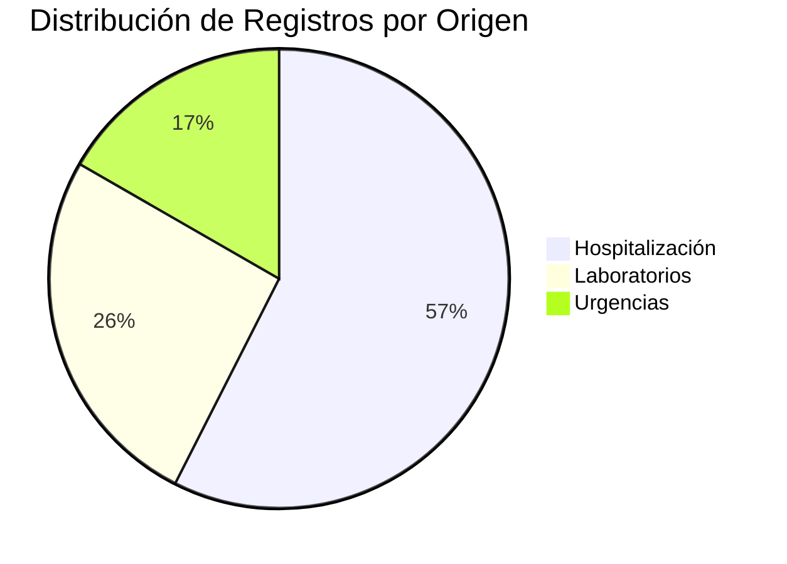

# 🏥 Proyecto Economía Salud - Análisis de Datos Hospitalarios

[](https://www.python.org/downloads/)
[](https://pandas.pydata.org/)
[](LICENSE)

## 📋 Tabla de Contenidos

- [🎯 Descripción del Proyecto](#-descripción-del-proyecto)
- [🏗️ Arquitectura Propuesta](#️-arquitectura-propuesta)
- [📊 Working Backwards](#-working-backwards)
- [🚀 Quick Start](#-quick-start)
- [📁 Estructura del Proyecto](#-estructura-del-proyecto)
- [⚙️ Configuración y Setup](#️-configuración-y-setup)
- [🔄 Flujo de Procesamiento](#-flujo-de-procesamiento)
- [📈 Insights y Hallazgos](#-insights-y-hallazgos)
- [🔧 Scripts y Funcionalidades](#-scripts-y-funcionalidades)
- [📊 Preparación para Dashboard](#-preparación-para-dashboard)
- [🤝 Contribución](#-contribución)
- [📄 Licencia](#-licencia)

## 🎯 Descripción del Proyecto

Este proyecto analiza datos hospitalarios para comprender el flujo de atención médica, optimizar costos y preparar la base para un dashboard interactivo. El análisis se centra en la relación entre identificadores de atención (IAN) y expedientes hospitalarios, revelando patrones en el flujo de pacientes desde triage hasta hospitalización.

### 🎯 Objetivos Principales

1. **Análisis del Flujo de Atención:** Comprender la trayectoria de pacientes desde urgencias hasta hospitalización
2. **Estandarización de Datos:** Normalizar identificadores para análisis consistente
3. **Optimización de Costos:** Identificar patrones de gasto y oportunidades de mejora
4. **Preparación para Dashboard:** Estructurar datos para visualización interactiva

## 🏗️ Arquitectura Propuesta



### 🏛️ Componentes de la Arquitectura

| Componente | Tecnología | Propósito |
|------------|------------|-----------|
| **Data Processing** | Python, Pandas | ETL y análisis de datos |
| **Database** | PostgreSQL | Almacenamiento de datos procesados |
| **Backend API** | FastAPI/Flask | Servicios REST para dashboard |
| **Frontend** | React + TypeScript | Dashboard interactivo |
| **Cache** | Redis | Optimización de consultas |
| **Deployment** | Docker + AWS | Infraestructura escalable |

## 📊 Working Backwards

### 🎯 Resultado Final Deseado
Un dashboard interactivo que permita a los stakeholders:
- Visualizar el flujo de atención en tiempo real
- Analizar costos por servicio y paciente
- Identificar oportunidades de optimización
- Generar reportes automáticos

### 🔄 Proceso de Desarrollo

1. **Fase 1: Análisis de Datos** ✅
   - [x] Estandarización de expedientes
   - [x] Análisis del flujo IAN vs Expedientes
   - [x] Identificación de patrones de costos

2. **Fase 2: Preparación de Datos** 🔄
   - [ ] Diseño de esquema de base de datos
   - [ ] Migración de datos a SQL
   - [ ] Creación de índices optimizados

3. **Fase 3: Desarrollo Backend** 📋
   - [ ] API REST con FastAPI
   - [ ] Endpoints para consultas complejas
   - [ ] Sistema de autenticación

4. **Fase 4: Desarrollo Frontend** 📋
   - [ ] Dashboard con React
   - [ ] Visualizaciones con D3.js/Chart.js
   - [ ] Filtros y búsquedas avanzadas

5. **Fase 5: Despliegue** 📋
   - [ ] Containerización con Docker
   - [ ] Despliegue en AWS
   - [ ] Monitoreo y logging

## 🚀 Quick Start

### Prerrequisitos
- Python 3.8+
- pip o conda
- Git

### Instalación Rápida

```bash
# 1. Clonar el repositorio
git clone https://github.com/UCDS-INER/economia_salud.git
cd economia_salud

# 2. Crear y activar entorno virtual
python3 -m venv venv
source venv/bin/activate  # En Windows: venv\Scripts\activate

# 3. Instalar dependencias
pip install -r requirements.txt

# 4. Ejecutar análisis completo
python scripts/run_complete_analysis.py
```

## 📁 Estructura del Proyecto

```
economia-salud/
├── 📊 data/
│   ├── raw/                          # Datos originales (no versionados)
│   │   ├── Resultados Pacientes Jan 2024 - Jul 2024.csv
│   │   ├── Resultados Pacientes Jan-Jun 2025.csv
│   │   └── Resultados Pacientes Jul 2024 - Ene 2025.csv
│   ├── processed/                    # Datos procesados
│   │   ├── resultados_pacientes_combinados.csv
│   │   ├── resultados_pacientes_estandarizados.csv
│   │   ├── resumen_generado_2024_2025.csv
│   │   └── comparacion_resumenes.csv
│   └── database/                     # Scripts de base de datos (futuro)
│
├── 🔧 scripts/
│   ├── data_processing/              # Scripts de procesamiento
│   │   ├── join.py                   # Unión de archivos CSV
│   │   ├── standardize_expedients.py # Estandarización de expedientes
│   │   └── summarize.py              # Generación de resúmenes
│   ├── analysis/                     # Scripts de análisis
│   │   ├── eda.py                    # Análisis exploratorio
│   │   ├── analyze_ian_vs_expedients.py
│   │   ├── analyze_ian_expedient_differences.py
│   │   ├── analyze_cost_differences.py
│   │   └── analyze_multiple_expedients.py
│   ├── utils/                        # Utilidades
│   │   ├── filtrar_dataframe.py
│   │   └── ejemplos_filtrado_simple.py
│   └── run_complete_analysis.py      # Script principal
│
├── 📈 resultados/                    # Resultados de análisis
│   ├── reports/                      # Reportes detallados
│   ├── insights/                     # Insights clave
│   └── visualizations/               # Gráficos y visualizaciones
│
├── 🏗️ docs/                          # Documentación
│   ├── architecture/                 # Documentación de arquitectura
│   ├── api/                          # Documentación de API (futuro)
│   └── user_guides/                  # Guías de usuario
│
├── 🎨 frontend/                      # Dashboard React (futuro)
├── 🔌 backend/                       # API Backend (futuro)
├── 🐳 docker/                        # Configuración Docker (futuro)
├── 📋 requirements.txt               # Dependencias Python
├── 🐍 .python-version                # Versión de Python
├── 📝 .gitignore                     # Archivos ignorados
└── 📖 README.md                      # Este archivo
```

## ⚙️ Configuración y Setup

### 1. Configuración del Entorno

```bash
# Crear entorno virtual
python3 -m venv venv

# Activar entorno (macOS/Linux)
source venv/bin/activate

# Activar entorno (Windows)
venv\Scripts\activate

# Instalar dependencias
pip install -r requirements.txt
```

### 2. Configuración de Datos

```bash
# Crear directorios necesarios
mkdir -p data/raw data/processed data/database
mkdir -p resultados/reports resultados/insights resultados/visualizations
mkdir -p docs/architecture docs/api docs/user_guides
```

### 3. Verificación de Instalación

```bash
# Verificar instalación
python -c "import pandas, numpy; print('✅ Dependencias instaladas correctamente')"

# Ejecutar test básico
python scripts/utils/test_setup.py
```

## 🔄 Flujo de Procesamiento

### 📊 Pipeline de Datos


### 🔄 Pasos Detallados

#### 1. **Unión de Datos** (`scripts/data_processing/join.py`)
```bash
python scripts/data_processing/join.py
```
- **Input:** 3 archivos CSV de diferentes períodos
- **Output:** `data/processed/resultados_pacientes_combinados.csv`
- **Proceso:** Combina datos, agrega metadatos de origen

#### 2. **Estandarización** (`scripts/data_processing/standardize_expedients.py`)
```bash
python scripts/data_processing/standardize_expedients.py
```
- **Input:** Datos combinados
- **Output:** `data/processed/resultados_pacientes_estandarizados.csv`
- **Proceso:** Normaliza expedientes, elimina duplicados

#### 3. **Análisis Exploratorio** (`scripts/analysis/eda.py`)
```bash
python scripts/analysis/eda.py
```
- **Input:** Datos estandarizados
- **Output:** Reportes de análisis exploratorio
- **Proceso:** Estadísticas descriptivas, identificación de patrones

#### 4. **Análisis IAN vs Expedientes** (`scripts/analysis/analyze_ian_vs_expedients.py`)
```bash
python scripts/analysis/analyze_ian_vs_expedients.py
```
- **Input:** Datos estandarizados
- **Output:** Análisis del flujo de atención
- **Proceso:** Comparación de identificadores, categorización de pacientes

### 🎯 Script Principal

```bash
# Ejecutar todo el pipeline
python scripts/run_complete_analysis.py
```

## 📈 Insights y Hallazgos

### 🔍 Flujo de Atención Confirmado

| Métrica | Valor | Interpretación |
|---------|-------|----------------|
| **IAN = Expediente** | 0.02% | Hospitalización directa |
| **IAN ≠ Expediente** | 99.98% | Triage → Hospitalización |
| **Pacientes únicos** | 5,782 | Base de análisis |
| **Registros totales** | 2,399,200 | Volumen de datos |

### 💰 Análisis de Costos

| Categoría | Total | Promedio/Registro | % del Total |
|-----------|-------|-------------------|-------------|
| **Hospitalización** | $677M | $491 | 57.47% |
| **Laboratorios** | $305M | $492 | 25.85% |
| **Urgencias** | $197M | $492 | 16.69% |

### 📊 Distribución por Origen



### 🎯 Insights Clave

1. **Estandarización Exitosa:**
   - Reducción de 6,156 a 5,782 expedientes únicos
   - Eliminación completa de duplicados por formato

2. **Flujo de Atención Optimizado:**
   - 99.98% de pacientes siguen el flujo estándar
   - Solo 0.02% requieren hospitalización directa

3. **Oportunidades de Optimización:**
   - Concentración de costos en hospitalización
   - Potencial de mejora en procesos de laboratorio

## 🔧 Scripts y Funcionalidades

### 📊 Scripts de Procesamiento

| Script | Función | Output |
|--------|---------|--------|
| `join.py` | Unión de archivos CSV | Datos combinados |
| `standardize_expedients.py` | Estandarización de expedientes | Datos normalizados |
| `summarize.py` | Generación de resúmenes | Reportes ejecutivos |

### 🔍 Scripts de Análisis

| Script | Función | Output |
|--------|---------|--------|
| `eda.py` | Análisis exploratorio | Estadísticas descriptivas |
| `analyze_ian_vs_expedients.py` | Análisis de flujo | Categorización de pacientes |
| `analyze_cost_differences.py` | Análisis de costos | Comparaciones económicas |

### 🛠️ Scripts de Utilidades

| Script | Función | Output |
|--------|---------|--------|
| `filtrar_dataframe.py` | Filtros avanzados | Datasets filtrados |
| `ejemplos_filtrado_simple.py` | Ejemplos de uso | Casos de estudio |

## 📊 Preparación para Dashboard

### 🗄️ Esquema de Base de Datos Propuesto

```sql
-- Tabla principal de pacientes
CREATE TABLE pacientes (
    id SERIAL PRIMARY KEY,
    paciente_id INTEGER UNIQUE,
    ian_expediente VARCHAR(50),
    n_expediente_hosp VARCHAR(50),
    categoria_atencion VARCHAR(100),
    fecha_atencion TIMESTAMP,
    origen VARCHAR(50),
    area_servicio VARCHAR(100),
    monto_nivel_6 DECIMAL(15,2),
    created_at TIMESTAMP DEFAULT NOW()
);

-- Tabla de resúmenes por paciente
CREATE TABLE resumen_pacientes (
    id SERIAL PRIMARY KEY,
    paciente_id INTEGER,
    total_gasto DECIMAL(15,2),
    num_registros INTEGER,
    primer_atencion TIMESTAMP,
    ultima_atencion TIMESTAMP,
    servicios_utilizados TEXT[],
    FOREIGN KEY (paciente_id) REFERENCES pacientes(paciente_id)
);

-- Tabla de métricas agregadas
CREATE TABLE metricas_agregadas (
    id SERIAL PRIMARY KEY,
    fecha DATE,
    origen VARCHAR(50),
    total_pacientes INTEGER,
    total_gasto DECIMAL(15,2),
    promedio_gasto DECIMAL(15,2)
);
```

### 🔌 Endpoints API Propuestos

```python
# Endpoints principales para el dashboard
GET /api/pacientes                    # Lista de pacientes
GET /api/pacientes/{id}               # Detalles de paciente
GET /api/metricas/generales           # Métricas agregadas
GET /api/costos/por-origen            # Costos por origen
GET /api/flujo/atencion               # Análisis de flujo
GET /api/tendencias/temporales        # Análisis temporal
```

### 📊 Visualizaciones Planificadas

1. **Dashboard Principal:**
   - KPIs generales
   - Gráficos de tendencias
   - Filtros interactivos

2. **Análisis de Flujo:**
   - Diagrama de flujo de atención
   - Tiempos de transición
   - Cuellos de botella

3. **Análisis de Costos:**
   - Distribución por servicio
   - Comparativas temporales
   - Análisis de outliers

## 🤝 Contribución

### 🛠️ Guías de Desarrollo

1. **Fork del repositorio**
2. **Crear rama feature:** `git checkout -b feature/nueva-funcionalidad`
3. **Commit cambios:** `git commit -m 'Agregar nueva funcionalidad'`
4. **Push a la rama:** `git push origin feature/nueva-funcionalidad`
5. **Crear Pull Request**

### 📋 Estándares de Código

- **Python:** PEP 8, type hints, docstrings
- **JavaScript:** ESLint, Prettier
- **Commits:** Conventional Commits
- **Documentación:** Markdown, docstrings

### 🧪 Testing

```bash
# Ejecutar tests
python -m pytest tests/

# Cobertura de código
python -m pytest --cov=scripts tests/
```

## 📄 Licencia

Este proyecto está bajo la Licencia MIT. Ver el archivo [LICENSE](LICENSE) para más detalles.

---

## 📞 Contacto

- **Repositorio:** [UCDS-INER/economia_salud](https://github.com/UCDS-INER/economia_salud)
- **Issues:** [GitHub Issues](https://github.com/UCDS-INER/economia_salud/issues)

---

<div align="center">

**🏥 Proyecto Economía Salud** - Transformando datos en insights para la optimización hospitalaria

[](https://github.com/UCDS-INER/economia_salud)
[](https://github.com/UCDS-INER/economia_salud)

</div> 