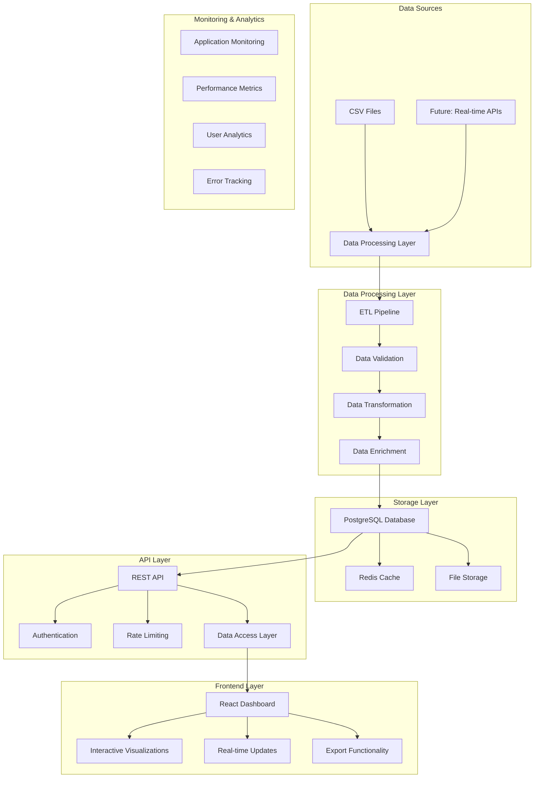

# 🏗️ Arquitectura del Proyecto Economía Salud

## 📋 Descripción General

Este documento describe la arquitectura completa del proyecto, desde el procesamiento de datos hasta el dashboard interactivo futuro.

## 🎯 Objetivos de la Arquitectura

1. **Escalabilidad:** Sistema capaz de manejar grandes volúmenes de datos hospitalarios
2. **Mantenibilidad:** Código bien estructurado y documentado
3. **Rendimiento:** Optimización para consultas rápidas y análisis en tiempo real
4. **Seguridad:** Protección de datos sensibles y autenticación robusta
5. **Flexibilidad:** Fácil extensión para nuevas funcionalidades

## 🏛️ Arquitectura de Alto Nivel



## 🔧 Componentes Técnicos

### 1. Data Processing Layer

| Componente | Tecnología | Propósito |
|------------|------------|-----------|
| **ETL Pipeline** | Python, Pandas, Apache Airflow | Extracción, transformación y carga de datos |
| **Data Validation** | Great Expectations, Pydantic | Validación de calidad y consistencia |
| **Data Transformation** | Pandas, NumPy | Normalización y enriquecimiento |
| **Data Enrichment** | Custom Python scripts | Agregación de metadatos y cálculos |

### 2. Storage Layer

| Componente | Tecnología | Propósito |
|------------|------------|-----------|
| **Primary Database** | PostgreSQL 14+ | Almacenamiento principal de datos |
| **Cache Layer** | Redis 6+ | Caché de consultas frecuentes |
| **File Storage** | AWS S3 / MinIO | Almacenamiento de archivos grandes |
| **Backup** | PostgreSQL WAL + S3 | Respaldo automático de datos |

### 3. API Layer

| Componente | Tecnología | Propósito |
|------------|------------|-----------|
| **Web Framework** | FastAPI | API REST de alto rendimiento |
| **Authentication** | JWT + OAuth2 | Autenticación y autorización |
| **Rate Limiting** | Redis + FastAPI | Control de velocidad de requests |
| **Documentation** | OpenAPI/Swagger | Documentación automática de API |

### 4. Frontend Layer

| Componente | Tecnología | Propósito |
|------------|------------|-----------|
| **Framework** | React 18 + TypeScript | Interfaz de usuario moderna |
| **State Management** | Redux Toolkit | Gestión de estado global |
| **Visualizations** | D3.js, Chart.js, Recharts | Gráficos interactivos |
| **UI Components** | Material-UI / Ant Design | Componentes de interfaz |
| **Real-time** | WebSockets / Server-Sent Events | Actualizaciones en tiempo real |

## 🗄️ Diseño de Base de Datos

### Esquema Principal

```sql
-- Tabla de pacientes
CREATE TABLE pacientes (
    id SERIAL PRIMARY KEY,
    paciente_id INTEGER UNIQUE NOT NULL,
    ian_expediente VARCHAR(50),
    n_expediente_hosp VARCHAR(50),
    categoria_atencion VARCHAR(100),
    fecha_atencion TIMESTAMP NOT NULL,
    origen VARCHAR(50) NOT NULL,
    area_servicio VARCHAR(100),
    monto_nivel_6 DECIMAL(15,2),
    created_at TIMESTAMP DEFAULT NOW(),
    updated_at TIMESTAMP DEFAULT NOW()
);

-- Tabla de resúmenes por paciente
CREATE TABLE resumen_pacientes (
    id SERIAL PRIMARY KEY,
    paciente_id INTEGER UNIQUE NOT NULL,
    total_gasto DECIMAL(15,2) NOT NULL,
    num_registros INTEGER NOT NULL,
    primer_atencion TIMESTAMP NOT NULL,
    ultima_atencion TIMESTAMP NOT NULL,
    servicios_utilizados TEXT[],
    categoria_flujo VARCHAR(50),
    created_at TIMESTAMP DEFAULT NOW(),
    FOREIGN KEY (paciente_id) REFERENCES pacientes(paciente_id)
);

-- Tabla de métricas agregadas
CREATE TABLE metricas_agregadas (
    id SERIAL PRIMARY KEY,
    fecha DATE NOT NULL,
    origen VARCHAR(50) NOT NULL,
    total_pacientes INTEGER NOT NULL,
    total_gasto DECIMAL(15,2) NOT NULL,
    promedio_gasto DECIMAL(15,2) NOT NULL,
    created_at TIMESTAMP DEFAULT NOW(),
    UNIQUE(fecha, origen)
);

-- Tabla de usuarios del sistema
CREATE TABLE usuarios (
    id SERIAL PRIMARY KEY,
    email VARCHAR(255) UNIQUE NOT NULL,
    nombre VARCHAR(100) NOT NULL,
    rol VARCHAR(50) NOT NULL,
    password_hash VARCHAR(255) NOT NULL,
    activo BOOLEAN DEFAULT TRUE,
    created_at TIMESTAMP DEFAULT NOW(),
    last_login TIMESTAMP
);
```

### Índices Optimizados

```sql
-- Índices para consultas frecuentes
CREATE INDEX idx_pacientes_fecha ON pacientes(fecha_atencion);
CREATE INDEX idx_pacientes_origen ON pacientes(origen);
CREATE INDEX idx_pacientes_ian ON pacientes(ian_expediente);
CREATE INDEX idx_pacientes_expediente ON pacientes(n_expediente_hosp);
CREATE INDEX idx_resumen_paciente_id ON resumen_pacientes(paciente_id);
CREATE INDEX idx_metricas_fecha_origen ON metricas_agregadas(fecha, origen);
```

## 🔌 API Endpoints

### Autenticación
```python
POST /api/auth/login          # Login de usuario
POST /api/auth/logout         # Logout de usuario
POST /api/auth/refresh        # Renovar token
GET  /api/auth/me             # Información del usuario actual
```

### Pacientes
```python
GET  /api/pacientes                    # Lista paginada de pacientes
GET  /api/pacientes/{id}               # Detalles de paciente específico
GET  /api/pacientes/search             # Búsqueda avanzada de pacientes
POST /api/pacientes/filter             # Filtros complejos
```

### Métricas y Análisis
```python
GET  /api/metricas/generales           # KPIs principales
GET  /api/metricas/tendencias          # Análisis temporal
GET  /api/costos/por-origen            # Costos por origen
GET  /api/costos/por-servicio          # Costos por servicio
GET  /api/flujo/atencion               # Análisis de flujo
GET  /api/flujo/tendencias             # Tendencias de flujo
```

### Reportes
```python
GET  /api/reportes/generar             # Generar reporte personalizado
GET  /api/reportes/descargar/{id}      # Descargar reporte
POST /api/reportes/programar           # Programar reporte automático
```

## 🔒 Seguridad

### Autenticación y Autorización
- **JWT Tokens:** Para autenticación stateless
- **OAuth2:** Para integración con sistemas externos
- **RBAC:** Control de acceso basado en roles
- **Rate Limiting:** Protección contra abuso

### Protección de Datos
- **Encriptación:** Datos sensibles encriptados en reposo
- **Anonimización:** Datos de pacientes anonimizados
- **Audit Trail:** Registro de todas las acciones
- **Backup Encryption:** Respaldos encriptados

## 📊 Monitoreo y Observabilidad

### Métricas de Aplicación
- **Performance:** Tiempo de respuesta, throughput
- **Errores:** Rate de errores, tipos de errores
- **Recursos:** CPU, memoria, disco, red
- **Negocio:** Usuarios activos, consultas populares

### Logging
- **Structured Logging:** Logs en formato JSON
- **Log Levels:** DEBUG, INFO, WARN, ERROR
- **Centralized Logging:** ELK Stack o similar
- **Retention Policy:** Política de retención de logs

## 🚀 Estrategia de Despliegue

### Entornos
1. **Development:** Desarrollo local
2. **Staging:** Pruebas de integración
3. **Production:** Ambiente de producción

### Containerización
```dockerfile
# Ejemplo Dockerfile para la API
FROM python:3.11-slim

WORKDIR /app
COPY requirements.txt .
RUN pip install -r requirements.txt

COPY . .
EXPOSE 8000

CMD ["uvicorn", "main:app", "--host", "0.0.0.0", "--port", "8000"]
```

### Orquestación
- **Docker Compose:** Para desarrollo local
- **Kubernetes:** Para producción
- **CI/CD:** GitHub Actions o GitLab CI

## 📈 Escalabilidad

### Estrategias de Escalado
1. **Horizontal Scaling:** Múltiples instancias de API
2. **Database Sharding:** Particionamiento de datos
3. **Caching Strategy:** Redis para consultas frecuentes
4. **CDN:** Para archivos estáticos

### Performance Optimization
- **Database Indexing:** Índices optimizados
- **Query Optimization:** Consultas eficientes
- **Connection Pooling:** Pool de conexiones
- **Async Processing:** Procesamiento asíncrono

## 🔄 Roadmap de Desarrollo

### Fase 1: MVP (Mes 1-2)
- [x] Procesamiento de datos básico
- [x] Análisis exploratorio
- [ ] API REST básica
- [ ] Dashboard simple

### Fase 2: Funcionalidades Avanzadas (Mes 3-4)
- [ ] Autenticación y autorización
- [ ] Reportes personalizados
- [ ] Visualizaciones avanzadas
- [ ] Exportación de datos

### Fase 3: Optimización (Mes 5-6)
- [ ] Performance optimization
- [ ] Caching strategy
- [ ] Monitoreo avanzado
- [ ] Documentación completa

### Fase 4: Escalabilidad (Mes 7+)
- [ ] Microservicios
- [ ] Kubernetes deployment
- [ ] Integración con sistemas externos
- [ ] Machine Learning features

---

## 📞 Contacto

Para preguntas sobre la arquitectura o contribuciones:
- **Issues:** [GitHub Issues](https://github.com/UCDS-INER/economia_salud/issues)
- **Documentación:** [Wiki del proyecto](https://github.com/UCDS-INER/economia_salud/wiki) 